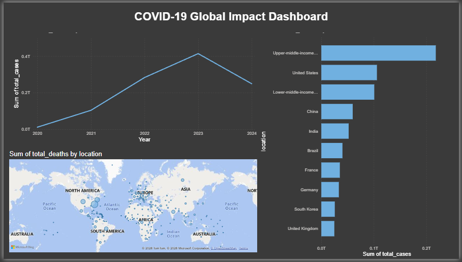

# 🦠 COVID-19 Global Trends Analysis



*(A snapshot of the Power BI Dashboard visualizing global infection trends)*

---

### 📊 Project Overview
A comprehensive data analysis project exploring global COVID-19 metrics to identify distinct patterns in infection growth, mortality rates, and population impact. This project utilizes **Advanced SQL** to clean and manipulate over **85,000+** records, transforming raw public health data into actionable insights focused on **India** and **Global Benchmarks**.

**Goal:** To determine the "risk factor" of contracting and surviving the virus across different geopolitical regions and time periods.

---

### 🛠️ Tech Stack & Skills
* **Database:** MySQL
* **Analysis:** Advanced SQL (Window Functions, CTEs, Joins)
* **Visualization:** Power BI (Trend Lines, Geospatial Mapping)
* **Techniques:**
    * `CTEs` for modular analysis
    * `Window Functions` (LAG, RANK, OVER) for time-series calculations
    * `Data Type Conversion` for handling mixed-format datasets
    * `Views` for storing complex queries for visualization

---

### 🔍 Key Analytical Insights

#### 1. Mortality Risk Assessment (Focus: India)
* **Objective:** Calculated the `DeathPercentage` (Total Deaths / Total Cases) to quantify the likelihood of mortality upon contraction.
* **Insight:** Analyzed how the risk of dying fluctuated during different "waves" of the pandemic in India, providing a historical view of healthcare system strain.

#### 2. Global Infection Density
* **Objective:** Identified countries with the highest infection rates relative to their population size.
* **Technique:** Used aggregate functions to compare `MAX(total_cases)` against `population` to normalize data for fair country-to-country comparison.

#### 3. "Flattening the Curve" Analysis
* **Objective:** Tracked day-over-day growth to identify inflection points in infection rates.
* **Technique:** Utilized the `LAG()` window function to compare current daily cases against the previous day's numbers, calculating the exact daily velocity of the spread.

#### 4. Cumulative Growth Tracking
* **Objective:** Visualized the continuous rise of cases without gaps.
* **Technique:** Implemented `SUM() OVER (PARTITION BY ... ORDER BY ...)` to generate rolling totals, enabling accurate time-series visualization in Power BI.

---

### 📈 SQL Code Snippets

**Calculating Rolling Infection Counts (Window Functions)**
```sql
SELECT 
    location, 
    date, 
    new_cases, 
    SUM(new_cases) OVER (PARTITION BY location ORDER BY date) as RollingPeopleInfected
FROM 
    covid_data
WHERE 
    location != 'World';
